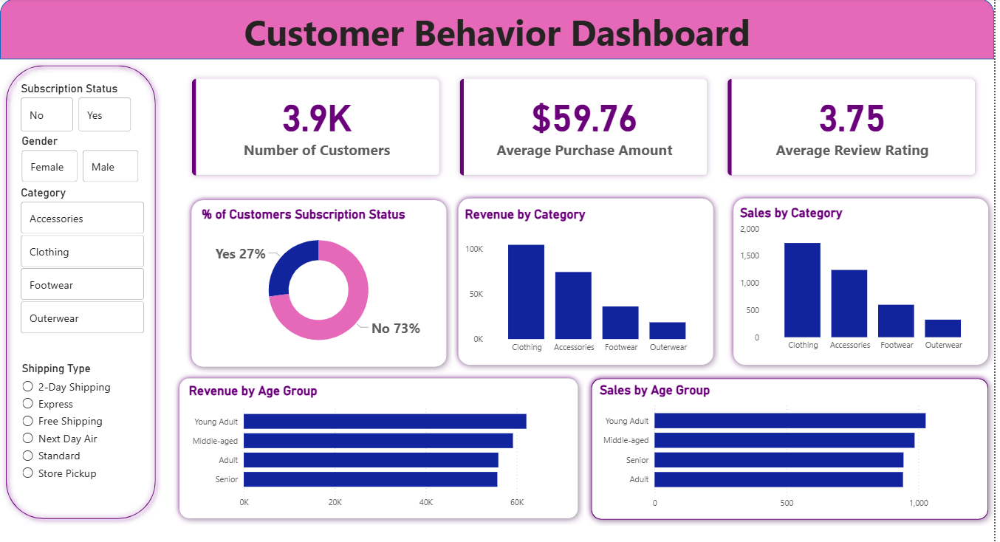

**🛍️ Customer Shopping Behavior Analysis**

End-to-End Data Analytics Portfolio Project

This project demonstrates a complete end-to-end data analytics workflow using real-world retail customer data. The goal is to transform raw transaction data into meaningful business insights that help organizations understand customer behavior and improve decision-making.

The project replicates the typical workflow followed by professional data analysts — from data cleaning and exploration to SQL analysis, visualization, and insight generation.

**🎯 Project Goal**

Retail businesses collect large amounts of customer data but often struggle to convert it into useful insights.
This project answers an important business question:

How can customer shopping data be leveraged to identify purchasing trends, understand customer segments, and improve marketing and product strategies?

Through this analysis, the project highlights how data can support data-driven decision making in retail businesses.

**👨‍💻 Who This Project Is For**

This project is especially useful for:

📊 Aspiring Data Analysts building a portfolio project.  
📚 Students learning Python, SQL, and Power BI.  
💼 Anyone preparing for Data Analytics interviews.  
📈 Professionals who want to understand end-to-end analytics workflows.  

**📌 Project Overview**

The project simulates a real analytics workflow that data teams typically perform inside organizations.

The workflow includes:
✔ Data Cleaning & Preparation
✔ Exploratory Data Analysis
✔ Business Query Analysis using SQL
✔ Interactive Dashboard Creation
✔ Insight Generation & Business Recommendations
The final output is an interactive Power BI dashboard that visualizes customer behavior trends.

**⚙️ Technologies Used**

This project uses a modern analytics stack:

Data Analysis
Python
Pandas
NumPy
Matplotlib
Seaborn
Database
MySQL
Visualization
Microsoft Power BI
Development Environment
Jupyter Notebook
Visual Studio Code

**🔍 Project Workflow**

This project follows a structured data analytics pipeline:

Customer Dataset
      ↓
Data Cleaning & Feature Engineering (Python)
      ↓
Exploratory Data Analysis
      ↓
Business Analysis with SQL
      ↓
Interactive Dashboard in Power BI
      ↓
Business Insights & Recommendations

**📊 Key Business Questions Answered**

Some of the analytical questions explored in this project include:

• What is the revenue contribution of different customer segments?
• Which products receive the highest customer ratings?
• Do customers who use discounts spend more than average?
• Which product categories generate the most purchases?
• How does customer age group influence purchasing behavior?

**📈 Dashboard & Insights**

The final stage of the project focuses on creating an interactive dashboard in Microsoft Power BI to visualize key insights such as:

✔ Customer segmentation
✔ Revenue distribution
✔ Top-performing products
✔ Purchase patterns across demographics
These visual insights help businesses understand customer trends and make better strategic decisions.

Example:

**📂 Project Structure**
Customer-shopping-behavior-analysis
│
├── Dataset
│   └── customer_shopping_behavior.csv
│
├── Notebook
│   └── Customer_Shopping_Behavior_Analysis.ipynb
│
├── sql
│   └── customer_behavior_analysis.sql
│
├── powerbi
│   └── Customer_behavior_dashboard.pbix
│
└── README.md

**🚀 How to Run This Project**

1️⃣ Clone the repository
git clone https://github.com/Manisha-S-j/Customer-shopping-behavior-analysis.git
2️⃣ Open the project in Visual Studio Code or Jupyter Notebook
3️⃣ Run the notebook to perform data cleaning and analysis
4️⃣ Load the processed dataset into MySQL
5️⃣ Execute SQL queries to answer business questions
6️⃣ Connect the database to Microsoft Power BI
7️⃣ Open the Power BI file to explore the interactive dashboard

**💡 Future Improvements**

This project can be extended further by:

• Implementing machine learning models to predict customer purchases
• Building recommendation systems for personalized product suggestions
• Integrating real-time sales data for live analytics
• Expanding the analysis to multiple stores or regions

**👩‍💻 Author**

Manisha S J
Data Analytics Project

GitHub Repository:
https://github.com/Manisha-S-j/Customer-shopping-behavior-analysis

⭐ If you found this project useful, feel free to star the repository and share it with others learning data analytics.
